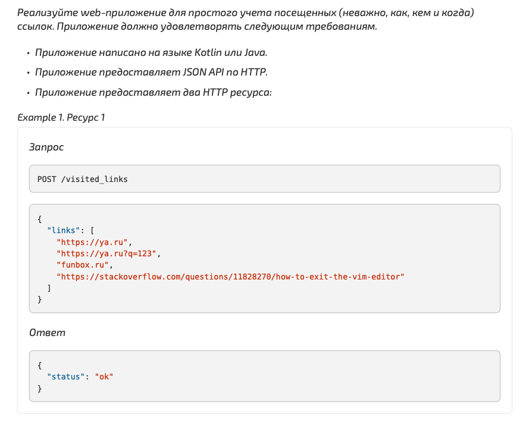
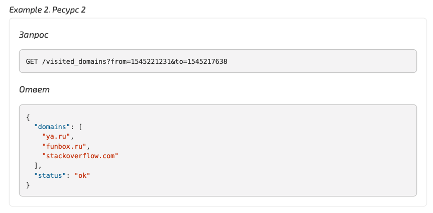

# Тестовое задание от компании FunBox

## Описание проекта
Spring Boot приложение по техническому заданию от компании. Код покрыт юнит-тестами.

## Техническое задание

## Используемые технологии
- **Spring Boot** фреймворк
- **H2** база данных
- **FlyWay** ассистент миграции
- **Lombok** кодогенерация
- **JUnit** система тестирования